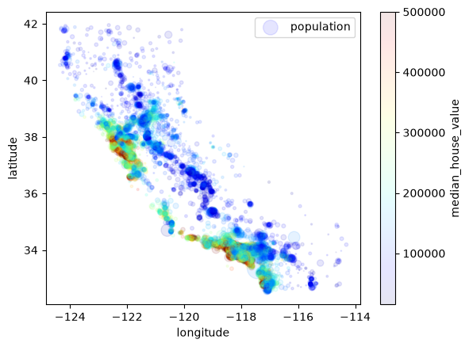
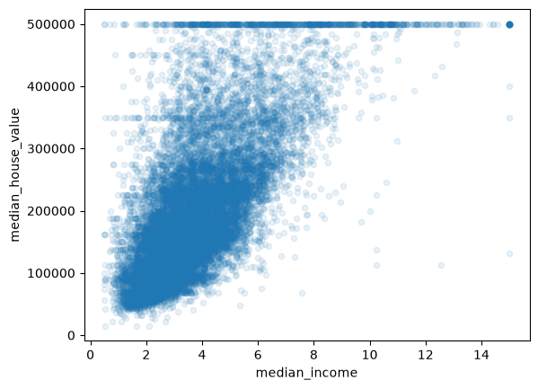

# California Housing Price Prediction

This project predicts California census block-group median house values using the California Housing Prices dataset. It follows a complete, beginner-friendly machine learning workflow: exploratory data analysis, preprocessing, baseline model comparison, cross-validation, Random Forest fine-tuning, final test evaluation, and documentation of the decisions made along the way.

The project is notebook-driven and designed as a practical learning project. It demonstrates how model choices should be based on validation evidence rather than training performance alone. It is not financial advice or a production-ready valuation system.

## Project Overview

This is a **supervised regression** project. The target is `median_house_value`, a continuous value measured in dollars, and the inputs describe location, housing, population, households, income, and proximity to the ocean.

The end-to-end workflow includes:

- exploratory data analysis (EDA);
- a stratified train/test split;
- missing-value handling and categorical encoding;
- ratio-based feature engineering and feature scaling;
- baseline training with Linear Regression, Decision Tree, Random Forest, and SVR;
- cross-validation to compare generalization;
- Random Forest tuning with `GridSearchCV` and `RandomizedSearchCV`;
- final comparison on the held-out test set; and
- detailed documentation of results, limitations, and lessons learned.

## Problem Statement

The goal is to build a model that predicts the median house value for a California block group. The model uses:

- longitude and latitude;
- median housing age;
- total rooms and bedrooms;
- population and households;
- median income; and
- ocean proximity.

The main evaluation metric is **Root Mean Squared Error (RMSE)**. RMSE is appropriate because the target is continuous, the result remains in dollars, and larger prediction mistakes receive more weight. Lower RMSE is better.

## Dataset

The project downloads the California Housing Prices dataset from the public [Hands-On Machine Learning dataset repository](https://raw.githubusercontent.com/ageron/handson-ml2/master/datasets/housing/housing.tgz).

| Item | Details |
| ---- | ------- |
| Dataset | California Housing Prices |
| Rows | 20,640 |
| Columns | 10 |
| Target | `median_house_value` |
| Problem type | Regression |
| Metric | RMSE |

The dataset has eight numerical input features, one categorical input (`ocean_proximity`), and one numerical target. `total_bedrooms` contains **207 missing values**: 20,433 of the 20,640 rows are non-null.

## Exploratory Data Analysis

The EDA in [`01_housing_EDA.ipynb`](notebooks/01_housing_EDA.ipynb) identified several findings that directly influenced preprocessing and modeling:

- `median_house_value` has a large spike near $500,000 and a maximum of $500,001, suggesting that the target is capped.
- `housing_median_age` has a spike and maximum at 52, suggesting that older values are also capped.
- `total_rooms`, `total_bedrooms`, `population`, and `households` are right-skewed.
- Raw count features are strongly affected by block-group size, so ratios can be more meaningful than totals.
- `median_income` has the strongest positive linear relationship with the target, with a correlation of **0.687151** in the training-set EDA.
- Location matters. Coastal and major urban areas around Los Angeles, San Diego, and San Francisco tend to have higher values, while inland and Central Valley areas tend to have lower values.
- `ocean_proximity` contains useful location information and must be encoded before modeling.



The capped target is visible in the income-versus-value plot as a horizontal line at the upper boundary:



## Preprocessing

The preprocessing and baseline workflow is implemented in [`02_preprocess_baseline.ipynb`](notebooks/02_preprocess_baseline.ipynb).

The project first creates a stratified 80/20 train/test split using median-income categories. Median income was used because EDA showed that it is strongly related to house value. Stratification keeps the income distribution similar across the training and test sets.

- Training set: **16,512 rows**
- Test set: **4,128 rows**

The preprocessing steps are:

1. Separate the nine input features from `median_house_value`.
2. Replace missing numerical values with training-set medians using `SimpleImputer(strategy="median")`.
3. Add ratio features with a custom `CombinedAttributesAdder` transformer.
4. Standardize numerical features with `StandardScaler`.
5. Encode `ocean_proximity` with `OneHotEncoder`.
6. Combine numerical and categorical transformations with `ColumnTransformer`.

The notebook explores label encoding, but the final pipeline uses one-hot encoding. Integer labels can create a fake ordering between nominal categories; one-hot columns represent each category without implying that one is greater than another.

The engineered features are:

- `rooms_per_household = total_rooms / households`
- `population_per_household = population / households`
- `bedrooms_per_room = total_bedrooms / total_rooms`

Raw totals often describe how large a block group is. These ratios more directly describe average home size, occupancy, density, and room composition.

The fitted preprocessing pipeline is saved as `models/full_pipeline.pkl`. Prepared training features and labels are saved under `data/processed/` for reuse by the tuning notebook.

## Model Training

Four baseline models were trained and compared with RMSE and 10-fold cross-validation. The following values come from the latest executed outputs in `02_preprocess_baseline.ipynb`:

| Model | Training RMSE | CV Mean RMSE | Interpretation |
| ----- | ------------: | -----------: | -------------- |
| Linear Regression | 68,627.87 | 69,104.08 | High training and validation errors indicated underfitting. |
| Decision Tree | 0.00 | 71,436.79 | A perfect training fit followed by high CV error confirmed severe overfitting. |
| Random Forest | 18,650.70 | 50,435.58 | Best baseline CV result, but the training/CV difference showed remaining overfitting. |
| SVR | 118,578.69 | 118,584.56 | Default-scale settings performed poorly on both training and validation data. |

Linear Regression was too simple for the relationships in the data. The unconstrained Decision Tree memorized the training set. SVR performed poorly with `C=1.0` and `epsilon=0.1`, which were not well matched to a target measured in hundreds of thousands of dollars.

Random Forest achieved the lowest mean cross-validation RMSE and the lowest fold-to-fold CV standard deviation among the baseline models. It was therefore selected for fine-tuning, while its overfitting remained an explicit concern.

## Fine-Tuning

Random Forest fine-tuning is implemented in [`03_fine_tune.ipynb`](notebooks/03_fine_tune.ipynb) and explained in the [fine-tuning decision document](docs/random_forest_fine_tuning_decisions.md).

The notebook used five-fold cross-validation and compared:

- **training RMSE**, which measures fit on each training fold;
- **validation RMSE**, which measures performance on held-out folds;
- **train-validation gap**, which helps identify overfitting; and
- **test RMSE**, which provides the final check on the protected test set.

`GridSearchCV` tested specific parameter combinations. Search ranges were adjusted when a winning value appeared at a grid boundary. `RandomizedSearchCV` then sampled 50 combinations from a wider search space.

The main hyperparameters were:

- `n_estimators`: number of trees;
- `max_features`: number of features considered at each split;
- `max_depth`: maximum tree depth;
- `min_samples_leaf`: minimum examples in a final leaf;
- `min_samples_split`: minimum examples required to split a node; and
- `bootstrap`: whether each tree trains on a bootstrapped sample.

The search process found that larger forests and fewer features per split improved validation performance. A deliberately regularized grid used shallower trees and larger leaves, reducing the train-validation gap but slightly worsening validation and test RMSE.

The best Randomized Search parameters were:

```python
{
    "bootstrap": False,
    "max_depth": 60,
    "max_features": 5,
    "min_samples_leaf": 1,
    "min_samples_split": 3,
    "n_estimators": 537,
}
```

## Final Model Comparison

The final notebook comparison used the best estimator from Grid Search 3, the best deliberately regularized grid estimator, and the best Randomized Search estimator.

| Model | Train RMSE | Validation RMSE | Gap | Test RMSE |
| ----- | ---------: | --------------: | --: | --------: |
| Randomized Search Random Forest | 2,439.25 | 48,306.41 | 45,867.16 | 45,991.62 |
| Grid Search 3 Random Forest | 18,109.88 | 48,997.20 | 30,887.32 | 46,779.89 |
| Overfit-Reduced Grid Search Random Forest | 24,870.73 | 49,231.84 | 24,361.11 | 46,953.64 |

Randomized Search achieved the lowest validation RMSE and the lowest test RMSE. It also had the largest train-validation gap, showing that it fit the training data extremely strongly.

The overfit-reduced model had the smallest gap and was more stable, but its held-out validation and test errors were slightly worse. The validation ranking already placed Randomized Search first, and the final test result confirmed that ordering among the three candidates.

## Final Model Decision

The selected model is the **Randomized Search Random Forest**. It achieved the best validation RMSE (**48,306.41**) and final test RMSE (**45,991.62**) among the compared candidates.

Its large train-validation gap (**45,867.16**) is an important limitation: the model still overfits the training data. However, the more regularized alternatives did not improve validation or test performance. The Randomized Search model was therefore selected for its stronger held-out results, with overfitting documented as an area for future improvement.

The saved search experiment is `models/random_forest_randomized_search.pkl`, and its cross-validation result table is `models/random_forest_randomized_search_results.csv`.

## Key Lessons Learned

- EDA revealed missing values, skewness, capped variables, geographic patterns, and useful feature-engineering ideas before modeling.
- Training performance alone can be misleading.
- A perfect training score can be evidence of overfitting rather than a successful model.
- Cross-validation provides a better estimate of generalization than training RMSE.
- Random Forest was a stronger baseline than Linear Regression, Decision Tree, and the initial SVR configuration.
- Fine-tuning improved held-out performance but did not eliminate overfitting.
- Randomized Search found a better combination than the manually designed grids.
- A smaller train-validation gap does not automatically mean lower validation or test error.
- The final test set should not be reused for further tuning. Future changes require a newly protected evaluation set for another unbiased final check.

## Repository Structure

```text
.
├── data/                                  # Generated locally; ignored by Git
│   ├── raw/
│   │   ├── housing.csv
│   │   ├── housing.tgz
│   │   ├── strat_train.csv
│   │   └── strat_test.csv
│   └── processed/
│       ├── housing_prepared_x.pkl
│       └── housing_labels.pkl
├── docs/
│   ├── about_data.md
│   ├── about_data_preprocess.md
│   ├── training.md
│   ├── random_forest_fine_tuning_decisions.md
│   └── images/
├── models/                                # Generated locally; ignored by Git
│   ├── full_pipeline.pkl
│   ├── lin_reg_v1.pkl
│   ├── decision_tree_v1.pkl
│   ├── random_forest_v1.pkl
│   ├── svr_v1.pkl
│   ├── grid_search_3.pkl
│   ├── grid_search_3_results.csv
│   ├── grid_search_overfit.pkl
│   ├── grid_search_overfit_results.pkl    # CSV-formatted table with a .pkl name
│   ├── random_forest_randomized_search.pkl
│   └── random_forest_randomized_search_results.csv
├── notebooks/
│   ├── 01_housing_EDA.ipynb
│   ├── 02_preprocess_baseline.ipynb
│   └── 03_fine_tune.ipynb
├── src/
│   ├── config.py
│   └── fetch_data.py
├── LICENSE
├── README.md
└── requirements.txt
```

`data/` and `models/` are excluded by `.gitignore`, so a fresh clone must regenerate those local artifacts by running the workflow.

## How to Run the Project

1. Clone the repository and enter the project directory.

   ```bash
   git clone https://github.com/surabhi1914/investment_analysis.git
   cd investment_analysis
   ```

2. Create and activate a virtual environment.

   ```bash
   python -m venv .venv
   ```

   Windows PowerShell:

   ```powershell
   .\.venv\Scripts\Activate.ps1
   ```

   macOS/Linux:

   ```bash
   source .venv/bin/activate
   ```

3. Install the declared dependencies.

   ```bash
   python -m pip install -r requirements.txt
   ```

4. From the repository root, download and extract the dataset.

   ```bash
   python -m src.fetch_data
   ```

5. Open the notebooks in VS Code or a Jupyter-compatible environment and run them in order:

   1. `notebooks/01_housing_EDA.ipynb`
   2. `notebooks/02_preprocess_baseline.ipynb`
   3. `notebooks/03_fine_tune.ipynb`

The notebooks currently use `Path.cwd().parent` to locate the project root. Run them with the notebook working directory set to `notebooks/` so imports and shared paths resolve correctly.

The fine-tuning notebook runs several large Random Forest searches and may take substantial time, memory, and disk space. It saves the fitted searches and result tables under `models/`.

## Main Dependencies

The repository imports and uses:

- Python
- pandas
- NumPy
- Matplotlib
- scikit-learn
- SciPy
- joblib
- ipykernel / a Jupyter-compatible notebook environment

Standard-library modules include `pathlib`, `urllib`, `tarfile`, `os`, and `sys`.

## Limitations

- `median_house_value` appears capped near $500,000, hiding differences among high-value districts.
- Several numerical variables are skewed, and `total_bedrooms` contains missing values.
- The final Randomized Search model has a very large train-validation gap and still overfits.
- Preprocessing was fitted on the full training set before cross-validation. A stricter workflow would cross-validate a combined preprocessing-and-model pipeline so preprocessing is learned separately within each fold.
- The three finalist models have already been evaluated on the test set. That test set should now remain closed to further tuning.
- The baseline Decision Tree save cell stores `forest_tree` as its model object while pairing it with Decision Tree scores and predictions. `decision_tree_v1.pkl` should be regenerated after that cell is corrected.
- `grid_search_overfit_results.pkl` contains CSV-formatted text despite its `.pkl` extension.
- The project does not yet include a reusable prediction script, automated tests, an API, or production monitoring.
- The current model should be validated further before any real-world or production use.

## Future Improvements

- Run residual and error analysis, especially for the largest mistakes and high-value districts.
- Inspect permutation importance and compare feature importance across validation data.
- Improve features using the EDA and error-analysis findings.
- Compare Gradient Boosting and `HistGradientBoostingRegressor`; optionally evaluate XGBoost after adding and documenting that dependency.
- Revisit SVR only with suitable target scaling and hyperparameter tuning.
- Cross-validate the complete preprocessing-and-model pipeline.
- Bundle the fitted preprocessing pipeline and selected model into a single inference artifact.
- Build a small prediction script that accepts raw district features.
- Add automated checks for data loading, custom feature engineering, and artifact integrity.
- Create a final report or error dashboard using the saved predictions and result tables.
- Correct the Decision Tree artifact and rename the overfit result table with a `.csv` extension.

## Documentation Links

- [Data understanding and preprocessing](docs/about_data.md)
- [Earlier combined data and preprocessing notes](docs/about_data_preprocess.md)
- [Baseline model training decisions](docs/training.md)
- [Random Forest fine-tuning decisions](docs/random_forest_fine_tuning_decisions.md)

## Author and License

Created by Surabhi Nair.

This project is licensed under the MIT License. See [LICENSE](LICENSE) for details.
