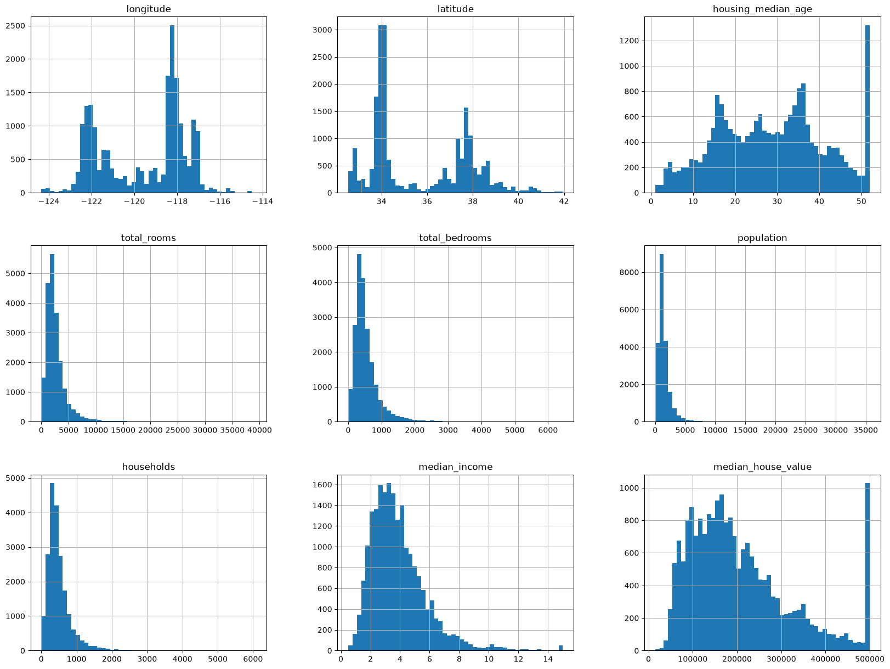

# Summary of the dataset

| Metric                | Value                                                                                                                                                                | Remarks |
| :-------------------- | :------------------------------------------------------------------------------------------------------------------------------------------------------------------- | ------: |
| Name of the dataset   | California Housing prices                                                                                                                                            |         |
| Shape of the dataset  | (20640, 10)                                                                                                                                                          |         |
| Column names          | 'longitude', 'latitude', 'housing_median_age', 'total_rooms', 'total_bedrooms', 'population', 'households', 'median_income', 'median_house_value', 'ocean_proximity' |         |
| Dependent variables   |                                                                                                                                                                      |         |
| Independent variables |                                                                                                                                                                      |         |
| Shape of the dataset  | (20640, 10)                                                                                                                                                          |         |

# Type of each columns

| Column name        |  Type   |                                                                        Remarks |
| :----------------- | :-----: | -----------------------------------------------------------------------------: |
| longitude          | float64 |                                                                 20640 non-null |
| latitude           | float64 |                                                                 20640 non-null |
| housing_median_age | float64 |                                                                 20640 non-null |
| total_rooms        | float64 |                                                                 20640 non-null |
| total_bedrooms     | float64 |                                       20433 non-null (contains missing values) |
| population         | float64 |                                                                 20640 non-null |
| households         | float64 |                                                                 20640 non-null |
| median_income      | float64 |                                                                 20640 non-null |
| median_house_value | float64 |                                                                 20640 non-null |
| ocean_proximity    |   str   | 20640 non-null  **Categories:** Inland, Near Ocean,  Near Bay, Island |

# EDA observations:

- The data might be capped for the house_median_age since there is huge spike at 52. 52 might be 52 or older. The model might treat all houses with age 52 as exactly the same, even though some could be 60, 80, or 100 years old.
- Total_rooms - right skewed. Most block groups have moderate room counts. a few block groups have extremely high room counts
  - Since larger block groups might have more room. We need to do feature engineering and create rooms_per_household = total_rooms / household
- total_bedrooms similar to total rooms
- population - rightly skewed. Most areas have small or medium populations. A few areas have extremely large populations. Population alone may mostly tell us the block size. A better feature is population_per_household = population/ households
- households- rightly skewed. It behaves like population, total_rooms, and total_bedrooms.
  These columns are connected. Bigger block groups naturally have:
  more rooms, more bedrooms, more people, more households
- median_income - rightly skewed.
- median_house_value - huge value spike at 500000. It likely means the target is capped at around $500,000.This affects prediction quality. If many expensive houses are capped at 500k, the model may underestimate luxury/high-value areas.
  
- LA, Sandiego, Sanfrancisco, Central valley like Sacramento seem to have more data and population also seems around these areas
- The prices seems to be higher around LA, Sandeigo, Sanfranciso but less around central valley. So the price might also get affected based on ocean proximity.

  

- correlation matrix for the median house value says that
  - strong positive correlation with median income
    
  - strong negative correlation with lattitude so as we go north the prices go down
  - no linear correlation with total bedroom and households, population, longitude
